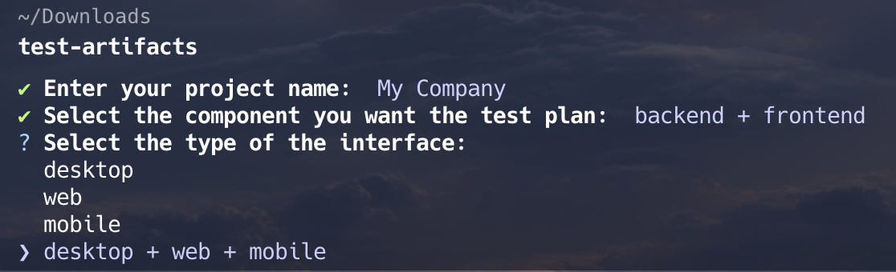
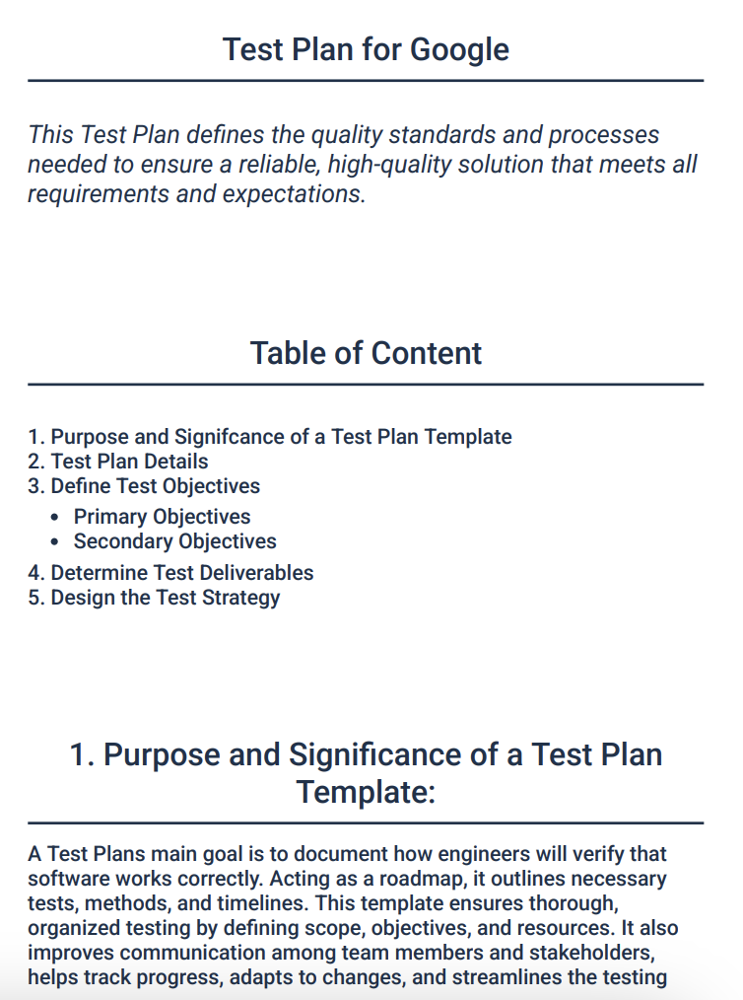

# test-artifacts


## Accelerate your testing process with efficient test artifacts generation tools.

Test Artifacts will provide you the best test artifact you need for your project, here is the following list of provided test artifacts already available:

|Test Plan|Performance Guideline|Test Strategy|Traceability Matrix|
|---|---|---|---|
|&#9989;|&#9989;|&#10060;|&#10060;|

Access our documentation to support you to get started:

* [Website Test Artifacts](https://test-artifacts.github.io/artifacts-test-site/)

* [View our projects on Github ](https://github.com/test-artifacts)

Assure you have installed nodeJS and npm:

https://nodejs.org/en/download/package-manager

Make sure you have those versions of nodeJS at least:

Node.js 20.x, 22.x and above (You may find some issues if you try an older version)

## Test Artifacts Commandline Usage:

Download globally test-artifacts commandline:

```
npm i test-artifacts -g
```

You can now open the terminal no matter the folder you are, running the following command:

```
test-artifacts
```



The PDF will be generated in the directory you ran the command:




## If you want to run this project locally you need to clone the project: 

```
git clone https://github.com/test-artifacts/artifacts-test-generator.git
```

## In the root of the project you need to install dependecies:

```
npm install
```

```
npm run commandline
```

## Generate test plan as an example:

```
npm run pdf:example:server
```

## For Client application whichs interacts with the browsers you can use the following example:

```
npm run pdf:example:client
```